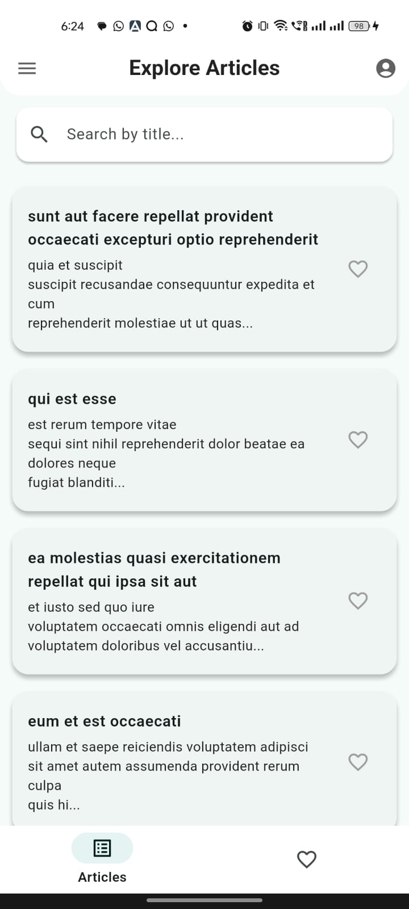
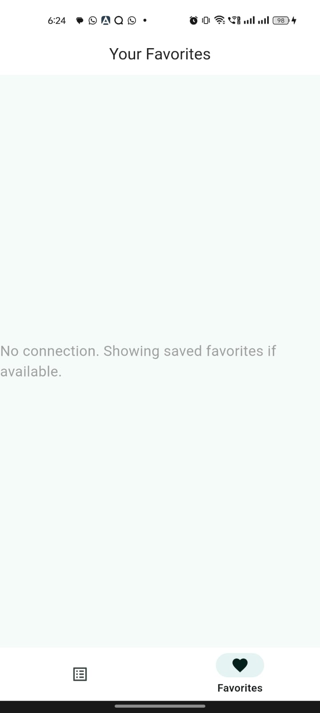
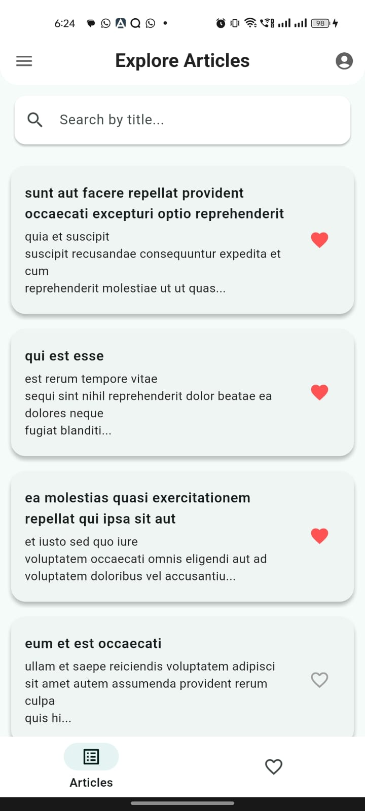
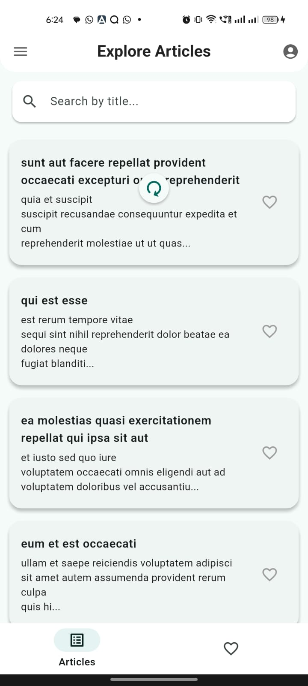
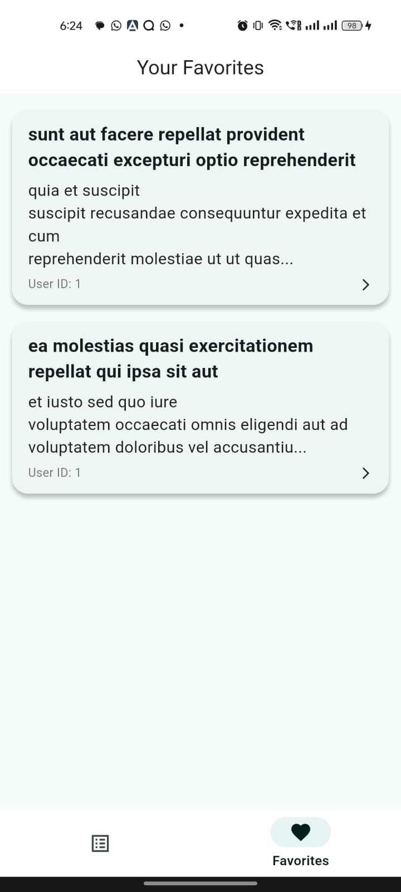
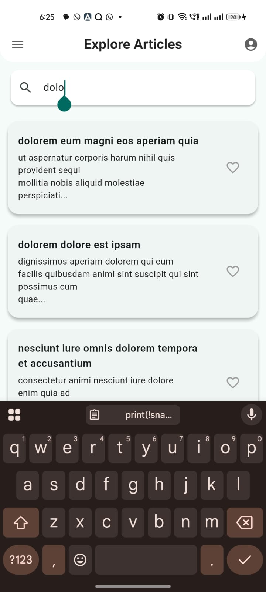

# 📰 Flutter Articles App

A clean and responsive Flutter app that fetches and displays a list of articles from a public API, with support for search, favorites, and offline persistence.

---

## 🚀 Features

- 📃 View list of articles
- 🔍 Real-time search by title
- 📄 Article detail view
- 🔄 Pull-to-refresh support
- 💖 Favorite/unfavorite articles
- 💾 Local persistence using `shared_preferences`
- 📱 Responsive layout with adaptive Material 3 design

---

## 🛠️ Setup Instructions

1. **Clone the repository**
   ```bash
   git clone https://github.com/palak-glitch/articles.git
   cd articles

2. Install dependencies:
   flutter pub get

4. Run the app:
   flutter run

## 🧰 Tech Stack
- Flutter SDK: =3.29.1 
- State Management: provider 
- HTTP Client: http
- Persistence: shared_preferences

Architecture: Clean, modular architecture with separation of concerns

## State Management Explanation
- The app uses the Provider package to manage state in a reactive and scalable way. ArticleProvider handles fetching, filtering, and 
persisting favorite articles, notifying the UI of state changes using ChangeNotifier.


## Known Issues / Limitations
- No pagination — all articles are fetched at once. 
- Currently supports only basic error handling and no retry mechanism.


## Screenshots (Optional)
[//]: # (![Home Screen]&#40;assets/1.jpg&#41;)

  
  
  
